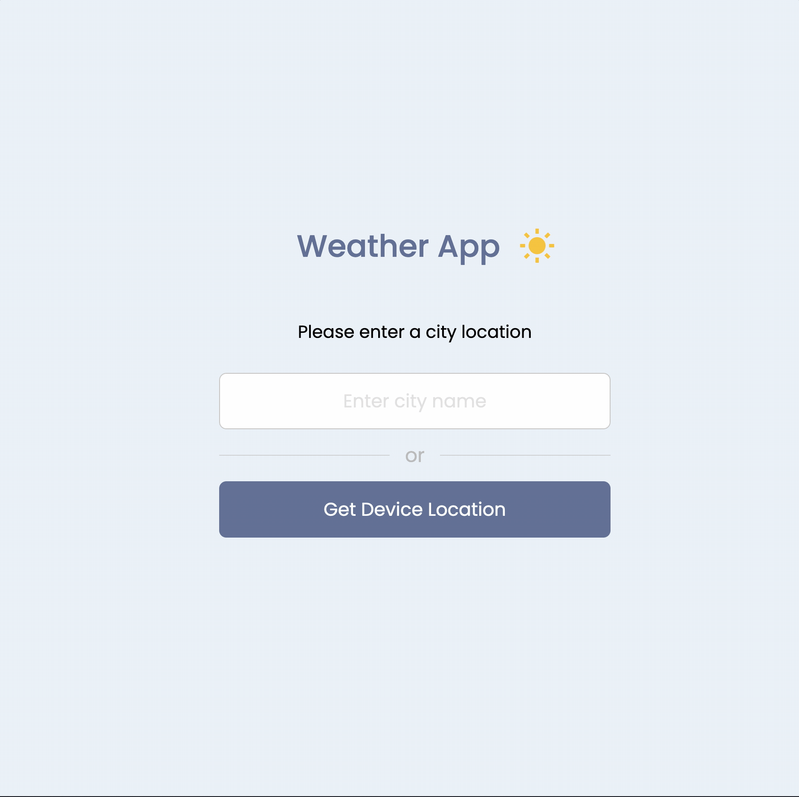

# Simple Weather App

This Simple Weather App allows the user to search for the current weather for a specified city. 

This application was developed to practice my knowledge with JavaScript and working with REST APIs


## Description

Allows user to enter a city name and display the current weather as well as show whether it's daytime or nighttime. The user can also use the geolocation of the browser to get your current location if browser allows. Will display warning/error if not compatible.
## API Reference
[openweather API](https://openweathermap.org/api)

```http
  https://api.openweathermap.org/data/2.5/weather
```

## Demo




## Tech Stack


### Tools


